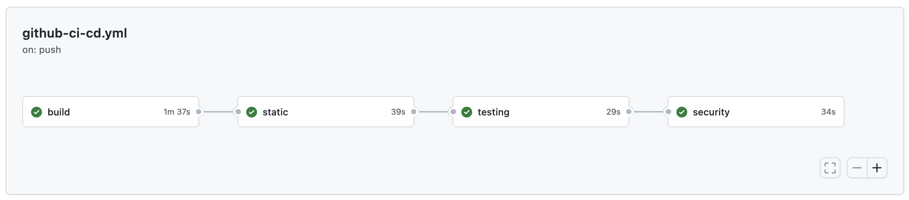
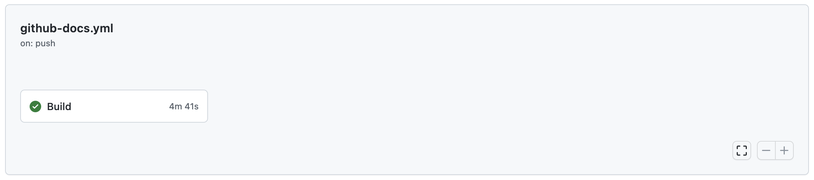
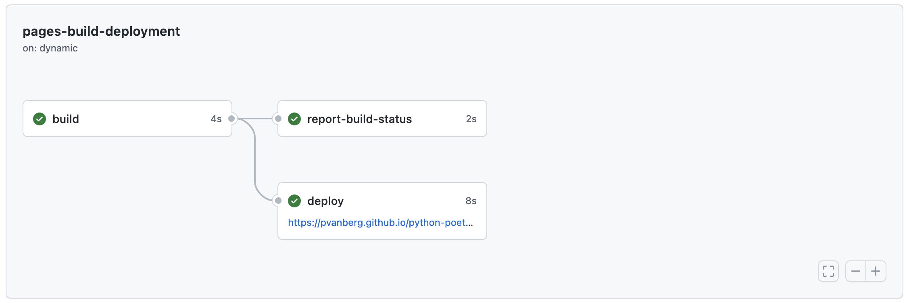
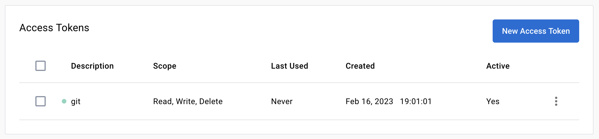
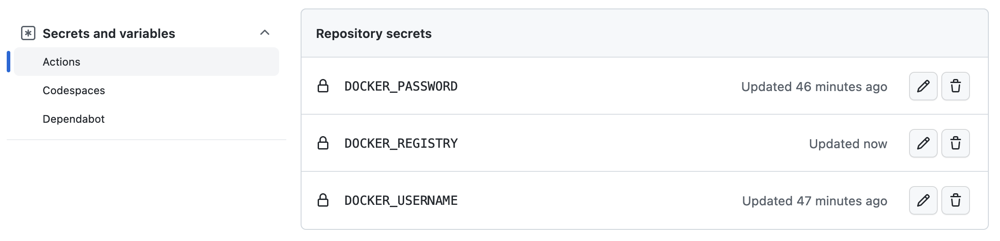
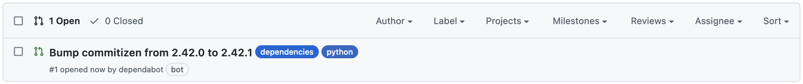

<p align="center">
   
</p>

<div>
 


</div>


<p align="center">
<a href="https://pvanberg.github.io/python-poetry-template/">Documentation</a> | <a href="https://github.com/pvanberg/python-poetry-template/actions"> Github Actions </a>
</p>

## Introduction

<p align="justify">
This template is designed to be used as a starting point for new python projects with support for dockerized development and deployment. This template focuses on standardization (static analysis, code quality) and automation (workflows).
</p>

#### Getting started

- <code>Use this template > Create a new repository</code> : First, you can clone this template from the UI by clicking on the upper left repository button.
- <code>Use this template > Open in codespace</code> : Second, you can directly try it out in Github codespace (build time <= 1.30min). Codespace is a Github feature that allows you to develop directly in the cloud using VSCode devcontainer. For more information, please refer to <a href="https://docs.github.com/en/codespaces">Github Codespace</a>.
- <code>git clone https://github.com/pvanberg/python-poetry-template.git</code> : Third, you can clone this template from the command line. 

#### Installation

Once the project cloned or the codespace ready, you can install the project dependencies. For development, you can use the `dev` extra to install the development dependencies.

```bash
poetry install --with=dev
```
or using pip:
```bash
pip install -e .[dev]
```

#### Features

This template includes the following features:

 - [Poetry](https://python-poetry.org/) - Python dependency management and packaging made easy.
 - [Pre-commit](https://pre-commit.com/) - A framework for managing and maintaining multi-language pre-commit hooks. Supports black, pylint, flake8, isort, mypy and more.
 - [Containers](https://www.docker.com/) - Build, ship, and run any application, anywhere.
 - [Devcontainer](https://code.visualstudio.com/docs/remote/containers) - Develop inside a Docker container while your code runs on the host.
 - [MkDocs](https://www.mkdocs.org/) - Fast, simple and beautiful documentation with Markdown.
 - [Github Pages]() - Publish your project documentation directly from your repository.
 - [Github Actions]() - Automate, customize, and execute your software development workflows right in your repository.

## Configuration

Prior to developement, you should update the following values according to your project. Do not forget to update the `LICENSE.md` file.

<table border="0">

   <tr>
      <th colspan="4">Configuration</th>
   </tr> 
   <tr>
      <th rowspan="2">Parameter</th>
      <th rowspan="2">Value</th>   
      <th colspan="2">References</th>
   </tr> 
   <tr>
      <td><b>Path</b></td>
      <td><b>Variable</b></td>
   </tr>

   <tr>
      <td rowspan="2"><code>AUTHOR_NAME</code></td>
      <td rowspan="2"><i>author</i></td>
      <td>pyproject.toml</td>
      <td>tool.poetry.authors</td>
   </tr>
   <tr>
      <td>mkdocs.yml</td>
      <td>site_author</td>
   </tr>

   <tr>
      <td rowspan="5"><code>PACKAGE_NAME</code></td>
      <td rowspan="5"><i>pypoetry_template</i></td>
      <td>src</td>
      <td>pypoetry_template</td>
   </tr>
   <tr>
      <td>pyproject.toml</td>
      <td>tool.poetry.name</td>
   </tr>
   <tr>
      <td>pyproject.toml</td>
      <td>tool.poetry.package.include</td>
   </tr>
   <tr>
      <td>mkdocs.yml</td>
      <td>repo_name</td>
   </tr>
   <tr>
      <td>mkdocs.yml</td>
      <td>plugins.mkdocstrings.watch</td>
   </tr>

</table>

## Project structure

<p align="justify">
This template is not intended to be a one-size-fits-all solution. It is designed to be a starting point for new dockerized python projects. It is up to you to decide which features you want to keep and which ones you want to remove. The goal is to provide a starting point that is easy to use and that can be easily adapted to your needs.
</p>

> Optional directory can be safely removed if you do not need them.

| Directory | Status | Description |
| --- | --- | --- |
| `.devcontainer` | Optional| Devcontainer is a VSCode feature that allows you to develop inside a Docker container while your code runs on the host. For more information, please refer to <a href="https://code.visualstudio.com/docs/remote/containers">VSCode documentation</a>. |
| `.github` | Optional| Github configuration, primary for actions is a feature that allows you to automate, customize, and execute your software development workflows right in your repository. For more information, please refer to <a href="https://docs.github.com/en/actions">Github documentation</a>. |
| `assets` | Optional| Assets are used to store additional files that are used within your project. </br> e.g. configuration files, images, etc. |
| `dockers` | Required | This template is designed with support for multi-containers applications. For this reason, the conventional root `dockerfile` is moved within a hierarichal structure. Such hierarchical pattern allow, the application to preserve consistency through docker composition paths. e.g. </br><code> dockers/dev/dockerfile</code></br><code>dockers/webapp/dockerfile</code>|
| `docs` | Optional| The docs directory contains everything related to the documentation of your project. It contains the documention styles, assets and pages which will be orchestrated by the `mkdocs.yml` configuration.|
| `lib` | Optional| Some projects require external library to be imported. While it is usually a bad practice, to directly include library sources in your project, some specific use cases require to directly embedes the library within the codebase. |
| `notebooks` | Optional| The notebooks directory contains all the Jupyter notebooks that are used to develop your project. |
| `scripts` | Optional| The scripts directory contains all the scripts that are used to develop your project. |
| `src` | Required | The src directory contains all the source code of your project. The source super structure, while note being mandatory, offers a clear separation between the source code and the rest of the project. |
| `tests` | Required | The tests directory contains all the tests of your project and should follow the same hierachical structure than the `src` directory. |

## Workflows

<p align="justify">
This template is designed to be used with Github Actions. It includes a set of workflows that are triggered on push and merge request events. The workflows are defined in the <code>.github/workflows</code> directory. The following workflows are included:
</p>

- [Continuous integration](.github/workflows/github-ci-cd.yml)
   - Builds the application docker image (`dev` service by default).
   - Static analysis (code quality): [black](https://black.readthedocs.io/en/stable/), [pylint](https://www.pylint.org/), [flake8](https://flake8.pycqa.org/en/latest/), [isort](https://pycqa.github.io/isort/), [mypy](https://mypy.readthedocs.io/en/stable/).
   - Check the code security: [bandit](https://bandit.readthedocs.io/en/latest/), [safety](https://pyup.io/safety/).
   - Runs the unit tests: [pytest](https://docs.pytest.org/en/stable/).

   <p align="center">
      
   </p>

- [Documentation](.github/workflows/github-docs.yml)
   - Build and serve MKDocs.
   <p align="center">
      
   </p>


## MkDocs

<p align="justify">
MkDocs is a fast, simple and downright gorgeous static site generator that's geared towards building project documentation. Documentation source files are written in Markdown, and configured with a <a href="mkdocs.yml">single YAML configuration file</a>. For more information, please refer to <a href="https://www.mkdocs.org/">mkdocs</a> documentation.
</p>

This package includes the following plugins:

 - [mkdocs-material](https://squidfunk.github.io/mkdocs-material/) - Material for MkDocs is a theme for MkDocs, a static site generator geared towards building project documentation.
 - [mkdocstrings](https://pawamoy.github.io/mkdocstrings/) - MkDocs plugin to generate API documentation from Python docstrings.
 - [mkdocs-gen-files]()
 - [mkdocs-literate-nav]()
 - [mkdocs-section-index]()

And additional features:

 - Automatic reference to the source code ([docs/gen_reference_pages.py](docs/gen_reference_pages.py)) and imports the associated docstring for each function.
 - Support for LaTeX equations directly within the code docstring thanks to `mathjax`.

#### Local deployment
To deploy the MKDocumentation locally, run the following command:

```bash
poetry run mkdocs serve
```

#### Github Pages deployment
<p align="justify">
The MkDocs documentation is automatically generated and published to Github Pages using the <code><a href="github/workflows/github-docs.yml">github-docs.yml</a></code> workflow. The workflow is triggered on each push to the main branch and on each release. The workflow will build the documentation and push it to the `gh-pages` branch. Then, a second workflow will be trigered on the `gh-pages` branch focused on the deployment. Once completed, the documentation website is available at <a href="https://pvanberg.github.io/python-poetry-template/">https://&lt;USERNAME&gt;.github.io/&lt;REPOSITORY_NAME&gt;/</a>. 
</p>

   <p align="center">
      
   </p>

**NOTE**: Prior to deployment make sure you have activated the `Github Pages feature` (`repository > settings > pages`) in the repository settings.

## Semver

<p align="justify">
Semver, or Semantic Versioning, is a widely accepted versioning system that provides clear and unambiguous communication about changes in software packages. It consists of a major version, minor version, and patch version, each with a specific meaning. For example, the first release of the template is tagged <code>MAJOR.MINOR.PATCH = 0.1.0</code>. For more information, please refer to <a href="https://semver.org/">semver</a> specification.
</p>

#### Docker
Semver is used to tag the docker image during Github workflow. This task is automated trough the [github-ci-cd.yml](.github/workflows/github-ci-cd.yml) workflow using [metadata-action](https://github.com/docker/metadata-action#semver). The workflow is triggered on each push to the main branch and on each release.

#### Automatic versioning

<p align="justify">
<a href="https://github.com/commitizen-tools/commitizen">Commitizen</a> is a command-line tool that helps developers create standardized commit messages (<a href="https://www.conventionalcommits.org/en/v1.0.0/">conventional commits</a>) following the conventions of the Semver versioning system. Use Commitizen to create your commit messages by running <code>poetry run cz commit</code> instead of <code>git commit</code>. This will prompt you to fill in the commit fields following the conventional format. The commit message will be automatically formatted and will internally update the project versioning according to the level of change (patch, minor, major). Finally, the <code>CHANGELOG.md</code> file may be automatically updated by running <code>poetry run cz bump</code> to bump the version of your package.
</p>

> **Note** The version bump and the <code>CHANGELOG.md</code> file update is manually triggered by the developer but it can also be automated by the Github workflow, see [commitizen-action](https://github.com/commitizen-tools/commitizen-action).

## Docker registry

<p align="justify">
Each time you create a new release on GitHub, you can trigger a workflow to publish your image. We use the Docker login-action and build-push-action actions to build the Docker image and, if the build succeeds, push the built image to Docker Hub. (see <a href="https://docs.github.com/en/actions/publishing-packages/publishing-docker-images">docs.github.com/publishing-docker-images</a>)
</p>

#### Docker Hub

 1) Go to https://hub.docker.com and login or register.

 2) **Optional** Once logged in, create a new repository named `PROJECT_NAME` (private or public). **Warning** If you skip this step, the image will be pushed using the default access. For free account, the default access is limited to 1 private repository.

 3) Go to the account Settings > Security and create a new access token.

   <p align="center">
      
   </p>

 4) Go back to github and go to your Repository then Settings > Secrets and Variables > Actions > Action secrets.  Add your docker registry (= docker.io), username and password (step 3 created access token) as secrets (`DOCKER_REGISTRY` `DOCKER_USERNAME` and `DOCKER_PASSWORD`). If

   <p align="center">
      
   </p>

 5) You are done. The [workflow](.github/workflows/github-ci-cd.yml) will automatically build and push the image to docker hub. Finally once your workflow run is completed, you can verify that your image is available on you docker hub ([example for this template](https://hub.docker.com/repository/docker/pvanberg/python-poetry-template-dev)).

#### Private docker registry

 1) Retrieve docker registry url and credentials.
 2) Update Github secrets - step (4) of the Docker Hub configuration.

 
## Dependabot

<p align="justify">
Dependabot is an automated dependency management tool that helps keep your GitHub repositories secure and up-to-date. It monitors your repository for outdated or vulnerable dependencies, and automatically creates pull requests to update them. With Dependabot, you can easily stay on top of security vulnerabilities and new versions of dependencies without the need for manual intervention (cf. <a href="https://docs.github.com/en/code-security/supply-chain-security/keeping-your-dependencies-updated-automatically">docs.github.com/dependabot</a>).
</p>

``` toml
python = ">=3.8.1,<=3.11"
wheel = "^0.38.1"
notebook = "^6.5.2"
```

1) Go to your repository > Insights > Dependency graph > Dependabot and verify that the dependabot configuration (`.github/dependabot.yml`) is correctly recognized and loaded.

2) Then enable Dependabot alerts, go to your repository > Settings > Code security & analysis > Dependabot alerts and enable the option.

3) You are done. Dependabot will automatically create pull requests to update your dependencies (PRs usually appear within few minutes). Note that if all your dependencies are up-to-date, no PR will be created.

   <p align="center">
      
   </p>
