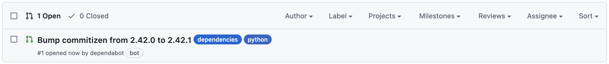

## Dependabot

<p align="justify">
Dependabot is an automated dependency management tool that helps keep your GitHub repositories secure and up-to-date. It monitors your repository for outdated or vulnerable dependencies, and automatically creates pull requests to update them. With Dependabot, you can easily stay on top of security vulnerabilities and new versions of dependencies without the need for manual intervention (cf. <a href="https://docs.github.com/en/code-security/supply-chain-security/keeping-your-dependencies-updated-automatically">docs.github.com/dependabot</a>).
</p>

``` toml
python = ">=3.8.1,<=3.11"
wheel = "^0.38.1"
notebook = "^6.5.2"
```

1) Go to your repository > Insights > Dependency graph > Dependabot and verify that the dependabot configuration (`.github/dependabot.yml`) is correctly recognized and loaded.

2) Then enable Dependabot alerts, go to your repository > Settings > Code security & analysis > Dependabot alerts and enable the option.

3) You are done. Dependabot will automatically create pull requests to update your dependencies (PRs usually appear within few minutes). Note that if all your dependencies are up-to-date, no PR will be created.

   <p align="center">
      
   </p>
