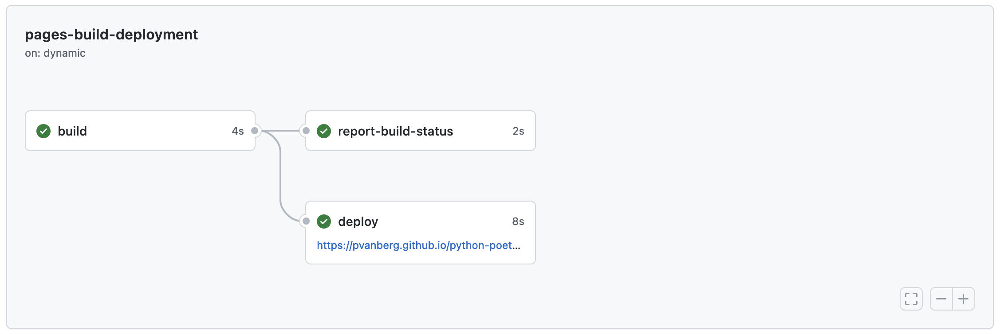

## MkDocs

<p align="justify">
MkDocs is a fast, simple and downright gorgeous static site generator that's geared towards building project documentation. Documentation source files are written in Markdown, and configured with a <a href="mkdocs.yml">single YAML configuration file</a>. For more information, please refer to <a href="https://www.mkdocs.org/">mkdocs</a> documentation.
</p>

This package includes the following plugins:

 - [mkdocs-material](https://squidfunk.github.io/mkdocs-material/) - Material for MkDocs is a theme for MkDocs, a static site generator geared towards building project documentation.
 - [mkdocstrings](https://pawamoy.github.io/mkdocstrings/) - MkDocs plugin to generate API documentation from Python docstrings.
 - [mkdocs-gen-files]()
 - [mkdocs-literate-nav]()
 - [mkdocs-section-index]()

And additional features:

 - Automatic reference to the source code ([docs/gen_reference_pages.py](docs/gen_reference_pages.py)) and imports the associated docstring for each function.
 - Support for LaTeX equations directly within the code docstring thanks to `mathjax`.

#### Local deployment
To deploy the MKDocumentation locally, run the following command:

```bash
poetry run mkdocs serve
```

#### Github Pages deployment
<p align="justify">
The MkDocs documentation is automatically generated and published to Github Pages using the <code><a href="github/workflows/github-docs.yml">github-docs.yml</a></code> workflow. The workflow is triggered on each push to the main branch and on each release. The workflow will build the documentation and push it to the `gh-pages` branch. Then, a second workflow will be trigered on the `gh-pages` branch focused on the deployment. Once completed, the documentation website is available at <a href="https://pvanberg.github.io/python-poetry-template/">https://&lt;USERNAME&gt;.github.io/&lt;REPOSITORY_NAME&gt;/</a>. 
</p>

   <p align="center">
      
   </p>

**NOTE**: Prior to deployment make sure you have activated the `Github Pages feature` (`repository > settings > pages`) in the repository settings.
