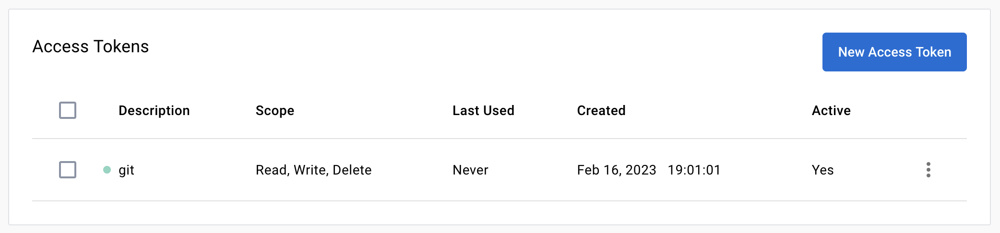
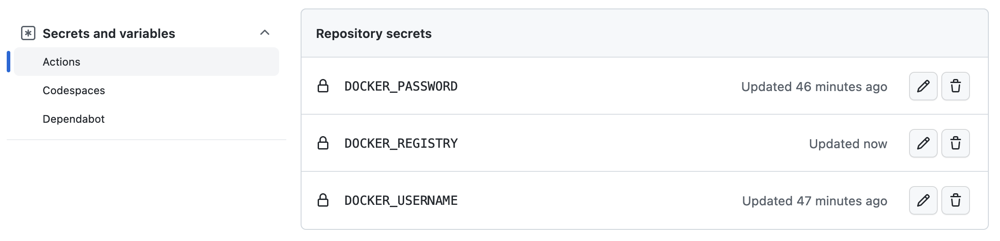

#### Docker Hub

 1) Go to https://hub.docker.com and login or register.

 2) **Optional** Once logged in, create a new repository named `PROJECT_NAME` (private or public). **Warning** If you skip this step, the image will be pushed using the default access. For free account, the default access is limited to 1 private repository.

 3) Go to the account Settings > Security and create a new access token.

   

      
   

 4) Go back to github and go to your Repository then Settings > Secrets and Variables > Actions > Action secrets.  Add your docker registry (= docker.io), username and password (step 3 created access token) as secrets (`DOCKER_REGISTRY` `DOCKER_USERNAME` and `DOCKER_PASSWORD`). If

   

      
   

 5) You are done. The [workflow](.github/workflows/github-ci-cd.yml) will automatically build and push the image to docker hub. Finally once your workflow run is completed, you can verify that your image is available on you docker hub ([example for this template](https://hub.docker.com/repository/docker/pvanberg/python-poetry-template-dev)).

#### Private docker registry

 1) Retrieve docker registry url and credentials.
 2) Update Github secrets - step (4) of the Docker Hub configuration.
