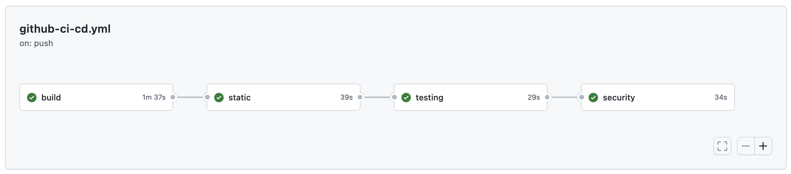
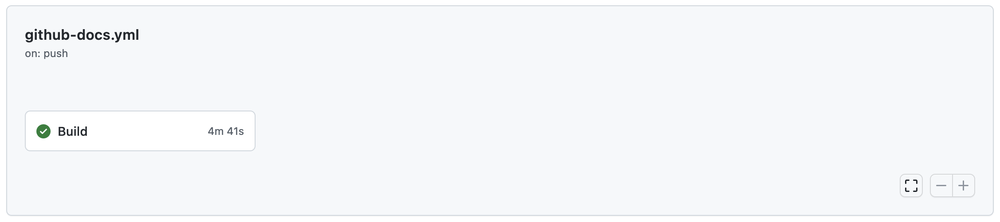

## Workflows

This template is designed to be used with Github Actions. It includes a set of workflows that are triggered on push and merge request events. The workflows are defined in the <code>.github/workflows</code> directory. The following workflows are included:

- [Continuous integration](.github/workflows/github-ci-cd.yml)
   - Builds the application docker image (`dev` service by default).
   - Static analysis (code quality): [black](https://black.readthedocs.io/en/stable/), [pylint](https://www.pylint.org/), [flake8](https://flake8.pycqa.org/en/latest/), [isort](https://pycqa.github.io/isort/), [mypy](https://mypy.readthedocs.io/en/stable/).
   - Check the code security: [bandit](https://bandit.readthedocs.io/en/latest/), [safety](https://pyup.io/safety/).
   - Runs the unit tests: [pytest](https://docs.pytest.org/en/stable/).

   

      
   

- [Documentation](.github/workflows/github-docs.yml)
   - Build and serve MKDocs.

   

      
   

